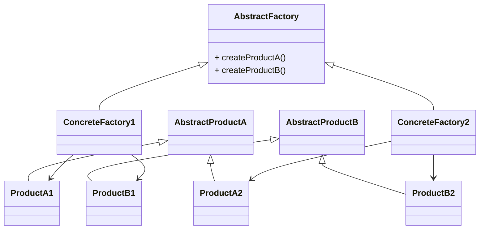
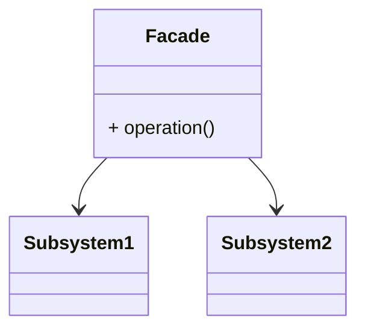
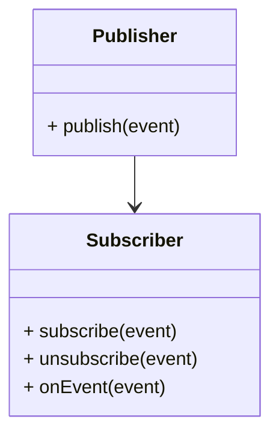

# Шаблони проектування

## Abstract Factory (Абстрактна фабрика)

**Опис:**
Абстрактна фабрика - це патерн проектування, який надає інтерфейс для створення сімейств пов'язаних або залежних об'єктів без указівки конкретних класів.

**Статична модель:**

## Facade (Фасад)
**Опис:**
Фасад - це патерн проектування, який надає простий інтерфейс до складної системи класів, бібліотек або фреймворків.

**Статична модель:**

## Publish/Subscribe (Публікувати/Підписуватися)

**Опис:**
Патерн Публікувати/Підписуватися - це патерн проектування, що використовує розподілену систему обробки подій для організації комунікації між компонентами.

**Статична модель:**

## Thread-Specific (Потоко-специфічний)

**Опис:**
Патерн Потоко-специфічний - це патерн проектування, який дозволяє кожному потоку мати свої власні дані, що не конфліктують з даними інших потоків.

**Статична модель:**
(Цей патерн часто не відображається в статичних моделях, оскільки це більше про організацію коду, ніж про структуру об'єктів.)
